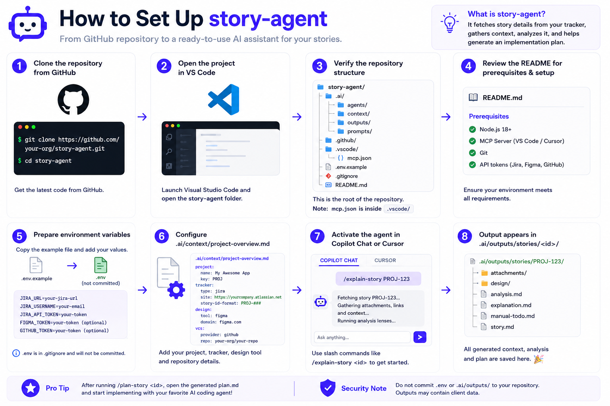

# story-agent — Quick Onboarding

Turn a story ID into a context folder and implementation plan in two prompts.


*Visual: story-agent workflow overview*

## TL;DR

```text
/explain-story PROJ-2356
/plan-story PROJ-2356
```

- `/explain-story` assembles story context + runs analysis lenses.
- `/plan-story` generates an implementation `plan.md`.
- Outputs are written to `.ai/outputs/stories/<id>/`.

## What It Does

- Pulls story details, comments, attachments, and linked context from MCP-backed tools (Jira by default; optional design/PR enrichment).
- Runs analysis lenses for architecture, state, edge cases, testing, and rollback.
- Produces structured artefacts (`story.md`, `analysis.md`, `explanation.md`, `plan.md`).
- Stays human-in-the-loop: no source edits, no auto-implementation.

## Quick Setup

1. Copy the bundle into your project:

```bash
git clone <repo-url> <local-path>/story-agent
cp -r <local-path>/story-agent/.ai .
cp -r <local-path>/story-agent/.github .
cp <local-path>/story-agent/.vscode/mcp.example.json .vscode/mcp.json
```

2. Add `.ai/outputs/stories/` to your `.gitignore`.
3. Add credentials in `.env` (recommended; Jira required, others optional):

```bash
cp .env.example .env

# required
JIRA_URL="https://yourcompany.atlassian.net"
JIRA_USERNAME="you@yourcompany.com"
JIRA_API_TOKEN="..."

# optional
FIGMA_TOKEN="..."
GITHUB_TOKEN="..."
```

4. Fill `.ai/context/project-overview.md` (at minimum: **Tooling**).
5. Load the vars in your shell before launching VS Code:

```bash
set -a
source .env
set +a
```

## Daily Usage

- `/explain-story <id>`
- `/plan-story <id>`
- Open `.ai/outputs/stories/<id>/plan.md` and execute steps with your regular coding agent.

Optional scoped run:

```text
/explain-story PROJ-2356 lens=architecture,testing
```

## Output Files

Inside `.ai/outputs/stories/<id>/`:

- `story.md` — verbatim story details and links.
- `attachments/` — downloaded files from tracker.
- `design/` — rendered design frames (if configured).
- `manual-todo.md` — SSO-blocked links requiring manual paste.
- `analysis.md` — lens-based impact analysis.
- `explanation.md` — concise narrative and open questions.
- `plan.md` — ordered implementation steps, risks, checks, rollback notes.

## Troubleshooting (Quick)

- **MCP server red/failed:** verify `.env` values are set and loaded, then restart VS Code from terminal.
- **No MCP detected:** reload window and confirm `.vscode/mcp.json` is loaded.
- **Generic analysis:** add concrete architecture/storage/testing paths in `.ai/context/project-overview.md`.
- **Missing ACs:** verify tracker field mapping in `.ai/context/project-overview.md`.
- **Plan names non-existent files:** enrich project structure details in `.ai/context/project-overview.md`.

## Safety + Scope

- Keep secrets in `.env`/environment variables; do not commit real tokens.
- `.ai/outputs/stories/` should remain gitignored.
- Story-agent is planning-first: it stops at `plan.md` and does not edit source by itself.

## Owner

- Shuchita Jain
