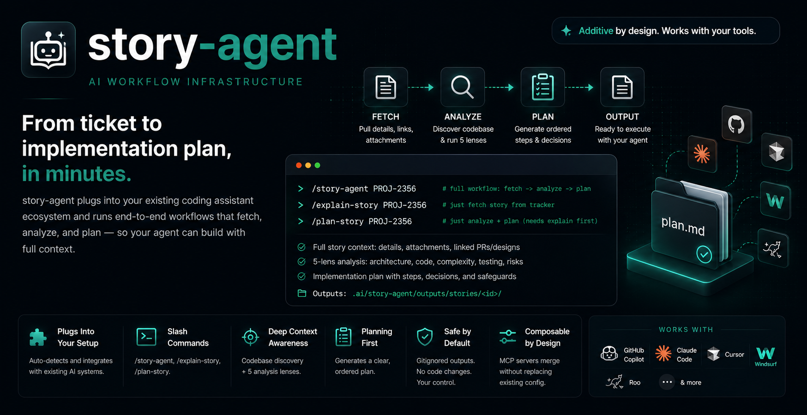

<div align="center">



# story-agent
> AI workflow infrastructure that plugs into your existing coding assistant ecosystem.

<p>
  <a href="#quick-start">Quick Start</a> •
  <a href="#existing-ai-systems-supported">Existing AI Systems Supported</a> •
  <a href="#mcp-setup">MCP Setup</a> •
  <a href="#daily-usage">Daily Usage</a> •
  <a href="#prerequisites">Prerequisites</a>
</p>

<p>
  <a href="https://www.linkedin.com/in/shuchita-jain/"></a>&nbsp;
  <a href="https://medium.com/@coderSJ"></a>
</p>


</div>

---

story-agent is additive by design. It does not replace your current setup for GitHub Copilot, Claude Code, Cursor, Windsurf, Roo, or other agent systems.

---

## TL;DR

```text
/story-agent PROJ-2356        # full workflow: fetch -> analyze -> plan
/story-agent path/to/story.md # same workflow, story from a local file
/explain-story PROJ-2356      # just fetch + explain (tracker ticket)
/explain-story path/to/story.md  # explain from a local file
/plan-story PROJ-2356         # just analyze + plan (needs explain first)
```

- `/story-agent` runs the full workflow end-to-end
- `/explain-story` accepts a tracker ticket ID, a local file path, or inline story text pasted directly into the prompt
- `/plan-story` discovers codebase context, runs 5 analysis lenses, generates plan
- Question classification and late-answer refresh are built into the workflow; they are not separate top-level agents
- Outputs: `.ai/story-agent/outputs/stories/<id>/`

## Quick Start

From the root of your project repo:

```bash
git clone https://github.com/shuchitajain/story-agent.git ./story-agent
./story-agent/scripts/story-agent init .
```

What init does:

- creates `.ai/story-agent/` in the target repo
- copies `agents/`, `prompts/`, and `outputs/` from story-agent into `.ai/story-agent/` in the target repo, without overwriting existing files
- creates or updates `AGENTS.md` in the repo root with a short story-agent usage paragraph
- creates or updates `CLAUDE.md` when a `.claude/` directory is already present
- installs `.github/agents/` wrappers when a `.github/` directory is detected (GitHub Copilot mode-dropdown agents)
- installs `.cursor/skills/` wrappers when a `.cursor/` directory is detected
- adds `.ai/story-agent/` to `.gitignore`
- merges story-agent MCP servers into existing MCP config files (`.vscode/mcp.json`, `.cursor/mcp.json`, `.mcp.json`, `~/.claude.json`, etc.) without removing existing servers

Running init multiple times is safe and idempotent.

Prompt behavior across IDEs:

- canonical agents always live in `.ai/story-agent/agents/`
- `.github/agents/` files are GitHub Copilot mode-dropdown wrappers (registered in the Copilot Chat agent selector)
- `.cursor/skills/` files are Cursor skill wrappers (invoked with `/explain-story`, `/plan-story`, `/story-agent`)
- IDE wrapper files delegate to the canonical agents; they are not the source of truth

## Existing AI Systems Supported

- **All repos:** `AGENTS.md` is created (or appended to) with a story-agent usage paragraph.
- **Claude Code:** `CLAUDE.md` is created (or appended to) only when a `.claude/` directory is already present.
- **GitHub Copilot:** `.github/agents/` wrappers are installed when a `.github/` directory is detected.
- **Cursor:** `.cursor/skills/` wrappers are installed when a `.cursor/` directory is detected.

All installs are additive. Existing content is never replaced.

## MCP Setup

story-agent no longer assumes ownership of a single MCP config path.

- if one or more MCP config files already exist (VS Code, Cursor, Claude-style), init merges required story-agent servers (`jira`, `figma`, `github`) only when missing
- if no MCP config exists, init creates one in the most likely workspace path (`.cursor/mcp.json`, `.mcp.json`, `.roo/mcp.json`, `.windsurf/mcp.json`, or fallback `.vscode/mcp.json`)
- existing server definitions are preserved

Claude Code note:
- Claude Code user/local MCP: `~/.claude.json` (default)
- Claude Code project MCP: `.mcp.json` (repo root)
- init merges both if they already exist
- init does not auto-create `~/.claude.json` (to avoid unexpected global machine-level changes)

Template used for merge:

`.ai/story-agent/templates/vscode/mcp.json`

## Daily Usage

All `/story-agent`, `/explain-story`, and `/plan-story` commands must run in agent mode.

```text
/story-agent <id|file-path|inline-story>
/explain-story <id|file-path|inline-story>
/plan-story <id>
/plan-story <id> lens=architecture,testing
continue story <id>
continue story <id> from task <N>
```

Open `.ai/story-agent/outputs/stories/<id>/plan.md` and hand off to your coding agent.

If the plan is taskized, hand off one task at a time. After each task passes its validation step:
1. Fill in `validation.md` for that task, including handoff notes for the next task.
2. Update `execution-state.json` (`current_task`, `completed_tasks`, `status`, `awaiting_human_approval`, `repo_anchor`).
3. Use `continue story <id>` in a new session to load the next task, or `continue story <id> from task <N>` when you need to target a specific task.

If the plan is unsplit, hand off the full plan as one bounded execution unit and record the final validation in `validation.md`.

Plan quality bar:

- detailed enough for an implementation agent to execute without guesswork
- concise enough for a human reviewer to scan quickly
- no long narrative restatement of the story or full lens output inside `plan.md`

## Output Files

Inside `.ai/story-agent/outputs/stories/<id>/`:

- `story.md` — verbatim story details and links
- `attachments/` — downloaded files from tracker
- `design/` — rendered design frames (if configured)
- `manual-todo.md` — access blockers and story gaps that need manual follow-up
- `analysis.md` — lens-based impact analysis
- `explanation.md` — concise narrative and likely impact preview; contains an "Open questions" section only when PM questions were left unanswered at the end of `explain-story`
- `decisions.md` — running ledger of all answered questions (PM and Engineering), written by both `explain-story` and `plan-story`; entries include category, audience, default assumption, answer, and implication
- `plan.md` — implementation brief; either unsplit for small changes or taskized for broader work
- `execution-state.json` — machine-readable task state; tracks the current task, completed tasks, approval state, status, and a repo anchor (git commit hash). Read by the orchestrator on resume. Updated by the implementation agent after each validated task.
- `validation.md` — human-readable validation receipt; created as a skeleton at plan-generation time and used for validation results, human approval, and task handoff notes. Always present.

## Prerequisites

Install `uv` (provides `uvx`, used by MCP servers):

```bash
curl -LsSf https://astral.sh/uv/install.sh | sh
which uvx && uvx --version
```

Add tracker credentials to `.env` (copy from `.env.example`).

## Safety + Scope

- Keep secrets in `.env`/environment variables; never commit real tokens
- `.ai/story-agent/outputs/stories/` should stay gitignored
- story-agent is planning-first: it stops at `plan.md` and does not edit source by itself

## Owner

- Shuchita Jain
